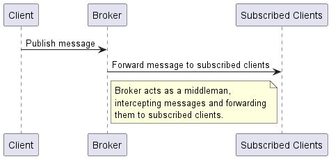
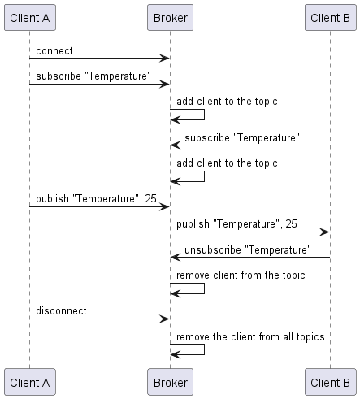

## HLVP Overview

HVLP, a training-focused simplification of the MQTT protocol, operates on a publish-subscribe model with clients and brokers serving as nodes. The broker manages message interception and forwarding to subscribed clients, with direct communication between clients being prohibited.



The publish-subscribe model allows the efficient redirection of the information to all the 
participants interested in it. The broker acts as a middleman intercepting incoming messages 
and forwarding them only to devices, which are subscribed to this topic.

## Protocol Operation

The following sequence diagram illustrates the operations of the HVLP protocol. Client A and 
Client B are two devices that communicate with each other through the Broker. The arrows indicate
the direction of the message flow.



1. Client A subscribes to the "Temperature" topic, 
2. Client B subscribes to the same topic.
3. Client A publishes a message to the "Temperature" topic, which the Broker forwards to Client B. 
4. Finally, Client B unsubscribes from the "Temperature" topic.

## Packet Structure

| Field                | Size (bytes) | Description                              |
|----------------------|--------------|------------------------------------------|
| HEADER [Packet ID]   | 1            | Identifier for the type of packet        |
| HEADER [Packet Size] | 1            | Size of the packet (maximum 255 bytes)   |
| Payload              | Variable     | Data content of the packet               |


## Message Types

| Packet       | ID   | Payload                                              |
|--------------|------|------------------------------------------------------|
| CONNECT      | 0x01 | Payload is not used                                  |
| DISCONNECT   | 0x02 | Payload is not used                                  |
| SUBSCRIBE    | 0x03 | Topic name as protocol string (see below)            |
| UNSUBSCRIBE  | 0x04 | Topic name as protocol string (see below)            |
| PUBLISH      | 0x05 | Topic name as protocol string (see below) + raw data |


## Protocol String

A string in the HVLP protocol is a sequence of characters that is prefixed with a length byte. 
For example, the string "Hello" is represented as follows:

- String = 'H', 'e', 'l', 'l', 'o'
- Length = 5
- Payload = 0x05, 'H', 'e', 'l', 'l', 'o'

```
Example: Subscribe packet with the topic "Hello"
-------------------------------------------------------------
Topic = 'Welcome'
Topic Length = 7 (1 for string length and 6 for the string)
Payload = 7, 'W', 'e', 'l', 'c', 'o', 'm', 'e'
Packet = 0x03, 0x08, 0x07, 'W', 'e', 'l', 'c', 'o', 'm', 'e'
```